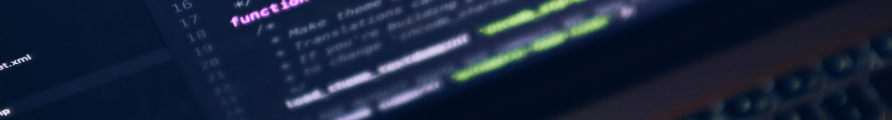

# Build-a-Library-Website
A collection of resources for State Libraries looking to provide web hosting services for small libraries.

**Jump To**: [State Library Website Hosting Programs](#state-library-website-hosting-programs) | [Resources](#resources) | [Tutorials & Manuals](#tutorials-and-manuals) | [Tools](#tools) | [Standards](#standards) | [Code](#code) | [Agreements & Legal Documents](#agreements-and-legal-documents) | [Contact Info](#contact-info)

### State Library Website Hosting Programs
#### [Idaho Commission for Libraries | eBranch](https://ebranch.lili.org/)
eBranch in a Box is an initiative from the Idaho Commission for Libraries (ICfL) to assist Idaho libraries in having a web presence, which is defined as having a vital website that is an extension of the library providing information about or access to library services.
#### [Nebraska Libraries on the Web](https://libraries.ne.gov/projectblog/)
Through this project, the Nebraska Library Commission will help your public library set up a free website. We use WordPress to make the website easier to set up and maintain.
#### [Colorado Virtual Library](https://www.coloradovirtuallibrary.org/technology/websites/)
The State Library’s Network & Resource Sharing department (NRS) provides websites free-of-charge for libraries, museums, and related organizations. NRS can help you create your site, host it for free, and deliver hands-on training to help you keep your site up and running. More than 40 Colorado Libraries and other organizations are using this service already.  
#### [Michigan Public Libraies in the Cloud (PLOUD)](https://www.michlibrary.org/)
The Library of Michigan subsidizes website hosting for Michigan libraries through Ploud (Public Libraries in the Cloud). Ploud serves over half of the small and rural libraries in the lower peninsula.  
#### [South Dakota Websites for Libraries](https://libguides.library.sd.gov/services/websites)
The South Dakota State Library is working with Mile Up web developers to help public libraries launch their own library websites.  
#### [Indiana CONNECT IN](https://www.in.gov/library/services-for-libraries/connect-in/)  
The Indiana State Library offers Connect IN to provide free high-quality and functional websites to public libraries. The program is free for public libraries without a current online presence and those having difficulty maintaining their existing site.  
#### [Washington ReadyWeb Project (WaRP)](https://www.betasite.org/)    
Free webhosting through the Washington ReadyWeb Project (WaRP), using the Drupal Content Management System, is available to public libraries in Washington from the Washington State Library, Office of the Secretary of State.  

### Resources
[Unsplash](https://unsplash.com/): Online source for free Images

### Tutorials and Manuals
[Getting Started with Markdown](https://github.com/fefong/markdown_readme#getting-started-with-markdown)  
[GitHub Flavored Markdown](https://github.github.com/gfm/)  
[Learn Photopea](https://www.photopea.com/learn/)  
[The	Washington	Readyweb	Project User Manual](https://www.betasite.org/sites/default/files/resources/Drupal.pdf)  
[Designing Your Library Website (Nebraska Library Commission](https://docs.google.com/document/d/1P5Nlbl-zU4d7ckRuLLaIVNZ5CCxYsrJCReZRarX-hMs/edit#/)

### Tools
#### [Photopea](https://www.photopea.com/)
Photopea is an advanced image editor, which can work with both raster and vector graphics. You can use it for simple tasks, such as resizing images, as well as complex tasks, such as designing webpages, creating illustrations, processing photographs and more.

### Standards

### Code

### Agreements and Legal Documents
[Idaho's eBranch in a Box User Service Agreement](https://libraries.idaho.gov/files/e-branch-agreement.pdf)

### Contact Info
Brian Tober  
Utah State Library  
btober@utah.gov  
801.715.6752  
